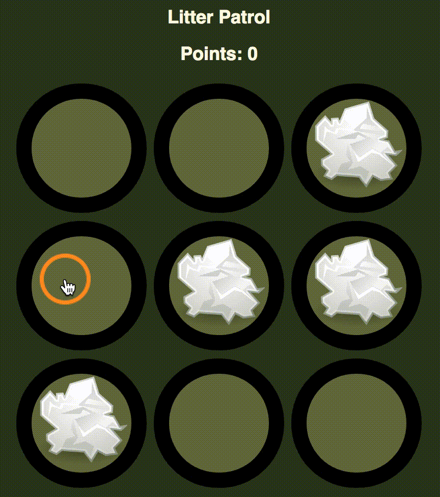

# Lessons Learned from One Week Teaching React

This cohort, Ada taught [React](https://reactjs.org/) as our front-end JavaScript framework for the first time. We're now at the end of the first week and I would say it went well - the students seem to have a solid understanding of the basics of React. Perhaps more importantly, students _enjoyed_ the content and are excited about learning more. If that's not a successful rollout then I don't know what is.

As with any new product we learned a lot from this initial run through the curriculum, both about what went well and what we could improve. The big lessons can be divided into four main categories:

- Go slow and focus on the fundamentals
- Give lots opportunities to practice
- Be careful about naming conventions
- Use more visuals

To give a little context about the program, this was week 17 of our 24-week program. Our adult students are with us 8 hours a day, 5 days a week. Prior to React we had 14 weeks of Ruby and Rails, and 2 weeks of vanilla JavaScript and jQuery.

If you're interested in seeing what we've come up with, our textbook is [free and open-source on GitHub](https://github.com/Ada-Developers-Academy/textbook-curriculum/tree/master/React).

## Slow and Steady Wins the Race

The number one complaint we get from students about lessons is that we introduce too many new things at once. Ideas get conflated, false associations are built, and students end up unable to apply concepts in different situations.

On the other hand when we build a sequence of lessons slowly, applying a laser focus to each individual learning goal, we find that we actually save time in the long run. Taking this measured approach allows students to understand _why_ they're writing the code they write, and how it fits into the big picture. That means they can apply the techniques more broadly, and when we build upon them in a future lesson things go much more smoothly.

With that in mind, we were intentional about easing into React. The schedule we ended up with looked something like this:

- **Day 1:** What is React? How do you build static components? How does JSX work? How do you use `props`?
- **Day 2:** Adding CSS, using `PropTypes`. Go through a big worksheet of static components.
- **Day 3:** Component state, simple event handling, using callbacks to talk to a parent component
- **Day 4:** Intro to controlled forms (this was a half-day)
- **Day 5:** Controlled forms

We spent _two whole days_ writing static components before we even told them that `state` was a thing. This may seem arduous - for comparison, the [official React tutorial](https://reactjs.org/tutorial/tutorial.html) introduces both `props` and `state` right away. However, I believe that the time was well-spent.

Taking that extra time allowed us to focus on some of the common patterns in React, like using `map` to transform data into an array of components. This is the sort of technique it would be easy to ignore as "just a React thing", especially for students who are still reeling from the idea of functions as first-class objects. It was absolutely worth the time to connect it back to prior learning, and I think most students ended up with a stronger understanding of JavaScript.

The one place where we didn't do this initially was our discussion of controlled forms. Our vision for that lesson and the associated project was a overly complex. Moreover Thursday is a short day for us at Ada, and we thought we could cover all the content in an hour and a half. Long story short, we were wrong.

Our staff did a good job of assessing student understanding in the moment, and we made the call to spend a good chunk of Friday morning talking about forms as well. This means we didn't have nearly as much project time as we would have liked, but it did give us the opportunity to double down on event handling and callbacks, making the connection both to previous event handling in React and to JavaScript fundamentals.

## Practice, Practice, Practice

One of the things we tried with React was using a sequence of small, highly-scaffolded exercises instead of one big project for the week. We follow a similar pattern when teaching a new programming language, but this is the first time we've done it to introduce a framework.

Here is the general strategy:
- Plenty of worksheets and exercises throughout the week for immediate reinforcement
- One small, targeted project each day, focused on whatever we just learned
- Projects should be highly scaffolded, especially in the beginning
  - Start with "fill in the render functions on these two components"
  - Move towards "here is a list of components to build"

As an example, take the [Litter Patrol](https://github.com/Adagold/litter-patrol) assignment from day 3. Most of the structure of the app is already there, but the students must implement state management (points, litter locations), and have to use callbacks to respond to user events in a child component. The project is easy enough to be done in an afternoon but still feels like a complete app.

 _Completed Litter Patrol project_

In practice, this technique seems to have worked very well. We have seen strong retention of the material that feels deeper than rote memorization. One of the big advantages is that it allows us to model high-level project organization, so that even on the last more open-ended project we spent much less time debugging tangled messes than we expected to.

The downside of this strategy is that it's a lot of work for the instructional team, both up-front (building and maintaining multiple worksheets, exercises and projects) and in class (keeping track of what's assigned / due when).

To help offset the up-front cost, we've partnered with the bootcamp [Code Platoon](www.codeplatoon.org). They gave us access to some of their React projects, and in exchange we'll be helping them transition their curriculum to Python over the next few months. Having tried and true assignments to build on made running this curriculum for the first time much smoother. Litter Patrol is an adaptation of their Whack-a-Mole project.

## Call Me by Your Name

The next lesson is one that took us by surprise but really shouldn't have: [clear naming conventions](https://en.wikipedia.org/wiki/Naming_convention_%28programming%29) are important. In particular, we needed to name things in a way that

1. Is consistent
1. Makes it obvious what each function or variable does
1. Clarifies where different pieces come from, particularly callback functions and event handlers

Our instructional team has many collective years of professional engineering experience, so hitting the first two requirements was a given. However for the third our experience ended up biting us, because what's clear to us is often difficult for our students. A naming convention that's meant to unify may end up sowing confusion.

Take for example making a DOM event on a child component affect the state of a parent component. To do this, you might need to:

1. Define a function in the parent component to manage state
1. Pass that function as a callback to a child component via `props`
1. In the child component, build another function to invoke the callback with the appropriate arguments
1. Attach the new function to a DOM element as an event handler

To an experienced JavaScript engineer this is a straightforward task. The obvious convention is to name the parent function and the prop the same thing, and make the function in the child anonymous. The result would be something like [this codepen](codepen.io/adadev/pen/oyLLXP).

But our students are not experienced JavaScript engineers - that's the whole point! They had been working with JavaScript for only two weeks when we started React, and for many working with functions was (is) still tricky business. To them this convention was about as clear as mud.

Fortunately Adies are good about speaking up when something is confusing - it's part of why I love this job. We worked together as a class to clarify our code over the course of the week, arriving at the following rules:

Situation | Rule | Examples
---       | ---  | ---
Function in the parent component | Named based on the business logic it performs | `addStudent`, `updateLastClicked`
Callback passed into props | Same name as the original with `Callback` appended | `addStudentCallback`, `updateLastClickedCallback`
Handler for a DOM event | Instance method on the corresponding component, with a name that indicates what event happened | `onFormSubmit`, `onButtonClick`

Following these rules with the buttons example yields [something like this](codepen.io/adadev/pen/eKzzEy). The code is a little more verbose but much more readable, especially for a novice. Applying them to the rest of our React curriculum should make things go a little smoother, both for the rest of cohort 9 and for C10.

## A Picture is Worth a Thousand Words

Our final big takeaway from delivering React for the first time is an idea we were already aware of, but teaching something new always hammers it home. [All sorts of research](https://journal.lib.uoguelph.ca/index.php/perj/article/view/3137/3473) has shown that regardless of learning styles, a combination of text and image is the best way to reach pretty much everyone. That means that lessons need pictures: in the textbook, on the whiteboard, and in students' notes.

In computer science we face the particular challenge of a topic that is highly abstract and often multi- or a-dimensional. Rapidly branching control flows, complex data structures and intricate sequences of events and callbacks rarely translate cleanly to a whiteboard. However, by keeping things simple and focusing on one process at a time we can help to clarify difficult topics.

For example, consider this visual I drew of the interactions between a controlled form and its parent element:

 _Ignore the scuffs and dings on this whiteboard - non-profit problems_

This image encodes a lot of information:
- The hierarchy between different components (top to bottom)
- The way that information is passed around (left is `props`, right is a callback)
- The distinction between two separate event cycles (colors)
- The rough order in which things happen (numbers)

There's also a lot that it leaves out, including component state and many of the details of event handling. Determining what to omit from a diagram is almost as difficult as figuring out how to present what you leave in.

There were several diagrams like this that arose in the moment, as a response to student confusion. Cleaning them up and adding them to our formal curriculum is going to be part of the work we do before we teach React again in December.

## Conclusion

Teaching React for the first time has been an enjoyable experience. Our team worked super hard getting this ready, and showed impressive wisdom and experience choosing what to cover and how to present it. Though there were inevitably some small things that could have gone better, adjustments going forward will be fine-tuning, not a total restructuring.

For me the four big takeaways boil down to a fundamental truth about teaching: it's better to go a little slower, cement understanding, and tie things in to prior learning. That means being conscious of where students are and what will be hard for them, and taking the time to build the curriculum to match. It's hard work, but no one ever took a teaching gig because it was easy.

Our job now is to take those learnings and apply them. We get a chance immediately as we continue to work with cohort 9, and in 6 months when cohort 10 gets to this point. I for one am excited to see how it goes from here.
